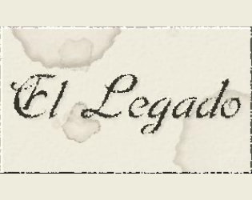

# El Legado

## Intro

_Ficción interactiva de misterio y terror, creada con HTML5 y <a href="http://baltasarq.github.io/fi-js/" target="_blank">fi.js</a>_.

Tu tío ha muerto.
El dolor te embarga... estabais tan unidos...

Tu tío siempre te dijo que tú heredarías su fortuna... y su responsabilidad.

Nunca supiste a qué se refería exactamente con aquella frase, que te decía cuando eras un niño y jugabas en sus brazos.

Los años pasaron, y tu tío acaba de morir dejándote como herencia su fortuna. Eso sí, para obtenerla, para ser merecedor de la misma, tendrías que pasar la noche en la biblioteca de su gran casa, y descubrir por tí mismo hasta dónde llegaba, y qué implicaba aquella herencia... sea lo que sea...

**<a href="https://baltasarq.github.io/legado/">Jugar</a>**

## Concurso

Esta aventura fue escrita para participar en la 3ª Nanocomp.

## Cómo jugar

Se trata de una aventura conversacional. Debes teclear las órdenes acerca de las acciones que el protagonista debe realizar. Sobre aventuras conversacionales, puedes encontrar información en:
http://caad.es/

Si quieres descargarte la primera versión (Glulxe, con ngPAWS/Paguaglús), necesitas un intérprete Glulxe para el archivo `gblorb`, como por ejemplo [Gargoyle](https://ccxvii.net/gargoyle/). 
